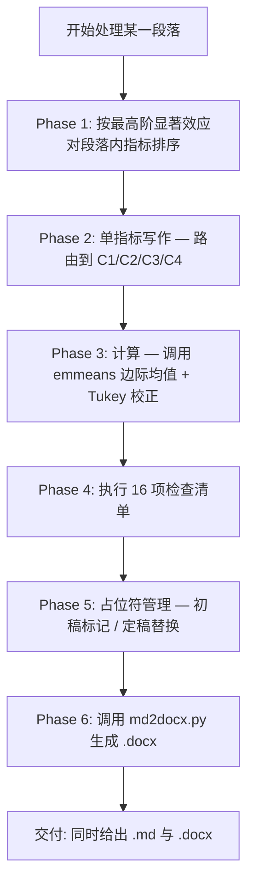
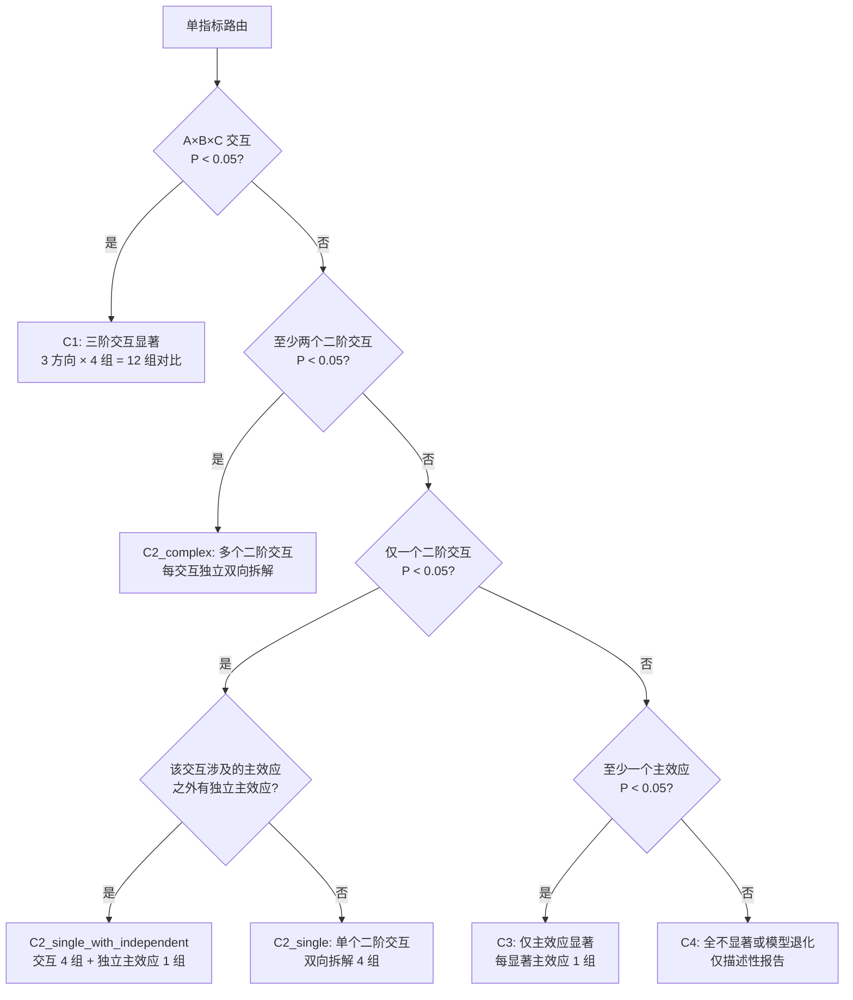

# three-factor-results-writer

> **三因素（2×2×2 完全析因）试验结果段落写作技能** — 把统计输出逐指标写成符合经典生态学期刊规范的结果（Results）段落，并一键导出 Word。

[](./SKILL.md)
[](./LICENSE)
[](./scripts/md2docx.py)
[](#)

---

## 目录

- [概述](#概述)
- [适用范围](#适用范围)
- [目录结构](#目录结构)
- [核心工作流](#核心工作流)
- [路由决策树](#路由决策树)
- [风格统一规范](#风格统一规范)
- [md2docx.py 转换器](#md2docxpy-转换器)
- [使用方式](#使用方式)
- [快速示例](#快速示例)
- [技术细节](#技术细节)
- [许可证](#许可证)

---

## 概述

本技能为 [WorkBuddy](https://www.workbuddy.cn) 智能体技能（Skill），用于将三因素完全析因设计的统计结果（ANOVA / LMM / GLMM）逐指标转化为符合经典生态学期刊投稿规范的结果段落。

**核心模式**：每个指标 = 统计分析 → 趋势分析 → 效应说明（先报检验量，再拆方向对比）。

**一句话纪律**：交互显著时，其涉及的主效应不作独立解释。

### 解决的痛点

| 痛点 | 本技能的解决方案 |
|------|-----------------|
| 三阶交互显著时不知如何拆解方向 | 固定两个因素看第三个，3 方向 × 4 组 = 12 组对比模板 |
| 两两比较 P 值与 ANOVA P 值混淆 | 强制区分：ANOVA P 不标"两两比较"，emmeans P 后置标注 |
| 百分比口径不统一 | 强制公式：百分比 = (差值 / 参照组均值) × 100，保留 2 位 |
| 中文论文统计符号格式混乱 | 半角标点统一、斜体统计符号规则、无空格乘号「×」 |
| 写完 Markdown 还要手动排版 Word | 内置 `md2docx.py` 零依赖转换器，一键生成期刊格式 .docx |

---

## 适用范围

### 适用设计

- 三因素**完全析因（交叉设计）**，每因素 2 水平，全为**分类变量**
- 支持模型类型：
  - 三因素方差分析（Three-way ANOVA）
  - 三因素线性混合模型（LMM）
  - 三因素广义线性混合模型（GLMM）

### 不适用（将提示用户改用其他方法）

- 嵌套设计、裂区设计
- 含连续变量因素（如温度梯度 22/25/28 ℃）
- 含协变量的模型

---

## 目录结构

```
three-factor-results-writer/
├── SKILL.md                          # 技能主文件（决策树 + 五阶段工作流 + 风格规范）
├── README.md                         # 本文件
├── references/
│   └── decision_tree.json            # 完整决策树（JSON 权威源）
│       ├── applicable_design         # 适用设计定义
│       ├── input_requirements        # 输入要求
│       ├── global_settings           # 全局规范（数值/语言/校正）
│       ├── style_rules               # 12 条风格统一规范
│       ├── phase_1_指标排序           # 指标排序规则（4 级优先级）
│       ├── phase_2_单指标写作         # 6 类情形完整模板
│       ├── phase_3_计算指令           # R 代码模板 + 拆解规格纪律 + 抽取规则
│       ├── phase_4_最终检查清单       # 16 项检查清单
│       ├── phase_5_占位符管理         # 占位符表
│       └── quick_reference           # 数值格式速查 + 情形汇总
└── scripts/
    └── md2docx.py                    # 零依赖 Markdown → Word 转换器
```

---

## 核心工作流

技能采用**五阶段 + 一导出**的工作流：



### Phase 1 — 指标排序

当一段落含多个响应指标时，按以下优先级决定写作顺序：

| 优先级 | 条件 | 说明 |
|--------|------|------|
| 1 | A×B×C 交互 P < 0.05 | 三阶交互显著 → 排最前（核心发现） |
| 2 | 三阶不显著，但至少一个二阶交互 P < 0.05 | 排其后 |
| 3 | 所有交互不显著，但至少一主效应 P < 0.05 | 排最后 |
| 4 | 全部不显著或模型退化 | 末尾补充说明 |

### Phase 2 — 路由到六类情形

见下文[路由决策树](#路由决策树)。

### Phase 3 — 计算指令

使用 R `emmeans` 包计算边际均值并执行 Tukey HSD 两两比较：

```r
# 三阶交互拆解（C1）
emm <- emmeans(model, ~ A | B * C); pairs(emm, adjust = 'tukey')

# 二阶交互拆解（C2）— 必须边际化第三因素
emm <- emmeans(model, ~ A | B); pairs(emm, adjust = 'tukey')

# 仅主效应（C3）
emm <- emmeans(model, ~ A); pairs(emm, adjust = 'tukey')
```

**抽取规则**：
- ANOVA P 值：从 `anova(model)` 提取，保留 3 位小数
- 两两比较 P 值：从 `pairs()` 提取 `p.value`，保留 3 位小数
- 差值：从 `pairs()` 提取 `estimate`，保留 2 位小数
- 参照组固定取较低水平

### Phase 4 — 检查清单（16 项）

每个指标生成后逐项核对，涵盖：
- 模型类型与随机因子报告完整性
- 拆解方向齐全性
- EMMs 使用与 P 值区分
- 交互显著时主效应不独立解释
- 禁用讨论式用语
- 数值精度（P 值 3 位，其余 2 位）
- 风格一致性（标点、符号、称谓、排版、图号、偏 η² 口径）

### Phase 5 — 占位符管理

初稿使用 `【响应变量名称】`、`【F值】`、`【P值】` 等占位符标记未知数据，用户填入后替换并核对一致性。

### Phase 6 — Word 导出

调用 `md2docx.py` 将结果 Markdown 转为同名 `.docx`，自动套用期刊排版规范。

---

## 路由决策树

每个指标根据显著性检验结果路由到以下六类情形之一：



### 六类情形速查

| 情形 | 标识 | 路由条件 | 对比组数 | 拆解方式 |
|------|------|----------|----------|----------|
| 三阶交互显著 | C1 | A×B×C P < 0.05 | 3×4 = 12 | 固定两个因素看第三个，3 方向 |
| 单个二阶交互 | C2_single | 仅一个二阶交互 P < 0.05 | 4 | 双向拆解 |
| 二阶交互 + 独立主效应 | C2_single_with_independent | 一个二阶交互 + 一个独立主效应 P < 0.05 | 4+1 = 5 | 交互双向 + 主效应直比 |
| 多个二阶交互 | C2_complex | ≥2 个二阶交互 P < 0.05 | 每交互 4 | 逐交互独立双向拆解 |
| 仅主效应 | C3 | 所有交互 P ≥ 0.05，≥1 主效应 P < 0.05 | 每主效应 1 | 直接两水平比较 |
| 全不显著 | C4 | 全部 P ≥ 0.05 或模型不收敛 | 0 | 仅描述性 |

### 关键纪律

- **C1（三阶显著）**：必须报方向 1（固定 B、C 看 A）和方向 2（固定 A、C 看 B），方向 3 推荐报
- **二阶交互显著**：双向拆解（固定一因素看另一因素 + 反之），涉及的主效应不作独立解释
- **C3（独立主效应）**：声明与其他因素的交互均不显著后，独立比较两个水平
- **C2 拆解规格**：必须边际化未参与交互的第三因素（`~ A | B`），禁止沿用 C1 的 `~ A | B * C` 做 4 层细拆

---

## 风格统一规范

以下 12 条规则覆盖所有易漂移项，全稿一致不得违反：

| # | 维度 | 规则 |
|---|------|------|
| 1 | 标点 | 中文正文用半角 `,` `.` `()`；禁止全半角混用 |
| 2 | 交互符号 | 无空格乘号 `A×B×C`；禁止 `A × B` |
| 3 | 两两比较标注 | 后置 `P = 值, 两两比较`；ANOVA P 不标 |
| 4 | 因子称谓 | 生物学中文称谓（「冷背景/暖背景」）；禁残留代号 |
| 5 | 拆解排版 | 连续段落，禁 bullet；三段间空行分隔 |
| 6 | 模型声明 | 节首集中声明一次，段内只报检验量 |
| 7 | 百分比双报 | 先变化量，再 `（+X.XX%, P = …, 两两比较）` |
| 8 | 图号 | 全文统一，初稿 `图【待补充】` |
| 9 | 偏 η² | 同类模型统一报或不报 |
| 10 | 内部标记 | C1–C4 仅过程用，禁入交付标题 |
| 11 | 位置尺度模型 | 须同时报告位置与尺度部分 |
| 12 | 统计符号字体 | F/P/χ² 等斜体，数值与自由度正体 |

### 数值格式（强制）

| 统计量 | 精度 | 示例 |
|--------|------|------|
| P 值 | 3 位小数 | `P = 0.023`, `P < 0.001` |
| F 值 | 2 位小数 | `F₁,₄₄₅ = 48.55` |
| χ² 值 | 2 位小数 | `χ²(₁) = 6.60` |
| 均值/差值 | 2 位小数 | `0.57 mm²`, `1.43 mg` |
| 百分比 | 2 位小数 | `+63.16%`, `−3.92%` |
| 标准差 | 2 位小数 | `24.41 ± 1.07` |

### 语言约束

禁止使用「表明」「说明」「显示」「揭示」「暗示」「证实」「证明」等讨论式用语。仅事实性陈述，以数据模式描述收尾，不作结论/价值判断。

---

## md2docx.py 转换器

`scripts/md2docx.py` 是一个**零依赖**的 Markdown → Word 转换器，仅使用 Python 3 标准库（`zipfile` + `xml`），无需 `python-docx`、`markdown` 等第三方包，无需联网安装。

### 用法

```bash
python md2docx.py 输入.md [输出.docx]
```

不指定输出路径时，自动生成同名 `.docx`。

### 排版规范

| 元素 | Markdown 写法 | Word 排版 |
|------|--------------|-----------|
| 一级标题 | `# xxx` | 黑体 16pt 加粗，左对齐 |
| 二级标题 | `## xxx` | 黑体 14pt 加粗，左对齐 |
| 三级标题 | `### xxx` | 黑体 13pt 加粗，左对齐 |
| 正文段落 | 直接写 | 宋体 + Times New Roman 12pt，两端对齐，1.5 倍行距，段前后 6pt |
| 粗体 | `**text**` | 加粗保留 |
| 斜体 | `*text*` | 斜体保留（用于 *F* / *P* / *χ²* 等统计符号） |
| 表格 | 管道表 | 细网格边框，表头加粗，10.5pt |
| 代码块 | ` ``` ` fence | Consolas 10.5pt |
| 引用 | `> text` | 左缩进 0.74cm |
| 页面 | — | A4，四边页边距 2.54cm |

### 支持的 Markdown 元素

标题（H1–H6）、段落、粗体、斜体、行内代码、代码块、有序/无序列表、表格（管道语法）、引用、分隔线。

### 特性

- **BOM 兼容**：以 `utf-8-sig` 读取，自动剥离 BOM 头，首行 `#` 标题不丢失
- **同名输出**：输出与输入同目录同名，重跑覆盖旧文件
- **跨平台**：Windows / macOS / Linux 均可直接运行

---

## 使用方式

### 在 WorkBuddy 中使用

本技能为 WorkBuddy 智能体技能，安装后自动在以下场景触发：

1. 用户提供三因素析因试验的统计结果（F/χ²/df/P 值），要求生成结果段落
2. 用户要求"按生态学期刊规范""逐指标""先统计后趋势"地写作
3. 用户提供长格式响应数据 + 模型输出，要求基于边际均值拆解对比

### 独立使用 md2docx.py

```bash
# 基本用法
python scripts/md2docx.py results.md

# 指定输出路径
python scripts/md2docx.py results.md output/results.docx
```

### 在 R 中计算边际均值

```r
library(lme4)
library(emmeans)

# 拟合模型
model <- lmer(response ~ A * B * C + (1|block), data = dat)

# 三阶交互拆解（C1）
emm_dir1 <- emmeans(model, ~ A | B * C)
pairs(emm_dir1, adjust = 'tukey')

# 二阶交互拆解（C2）— 边际化第三因素
emm_2way <- emmeans(model, ~ A | B)
pairs(emm_2way, adjust = 'tukey')

# 仅主效应（C3）
emm_main <- emmeans(model, ~ A)
pairs(emm_main, adjust = 'tukey')
```

---

## 快速示例

以下为 **C3（仅主效应显著）** 的风格示例：

> 三因素线性模型中，若虫体面积受发育温度（*F*₁,₄₄₅ = 48.55, *P* < 0.001）与背景温度（*F*₁,₄₄₅ = 12.30, *P* = 0.001）主效应的显著影响，农药背景主效应不显著（*F*₁,₄₄₅ = 0.84, *P* = 0.360），所有交互项均不显著（所有 *P* > 0.05）。27 ℃ 发育个体若虫体面积为 0.62 mm²（边际均值），较 22 ℃ 发育（0.38 mm²）升高 0.24 mm²（+63.16%, *P* < 0.001, 两两比较）；暖背景个体为 0.49 mm²，较冷背景（0.51 mm²）降低 0.02 mm²（−3.92%, *P* = 0.210, 两两比较）。各主效应可独立解释（所有交互均不显著）。

**要点解析**：
- 统计分析：报告 F 值（2 位）、P 值（3 位），声明交互不显著
- 趋势分析：边际均值（2 位）→ 差值（2 位）→ 百分比（2 位，后置两两比较 P）
- 效应说明：声明独立解释
- 风格：半角标点、斜体统计符号、中文因子称谓、连续段落

---

## 技术细节

### 输入要求

| 输入项 | 说明 |
|--------|------|
| 响应变量数据 | 长格式：响应值、因素 A/B/C 各水平标识、随机因子标识 |
| 统计模型输出 | 主效应及交互项的 F/χ² 值、df、P 值；随机因子方差组分 |
| 因素水平定义 | A/B/C 各两个水平的具体名称与单位 |

### 趋势分析方法

- **边际均值（EMMs）**：使用 R `emmeans` 包或等效软件计算
- **两两比较校正**：Tukey HSD
- **P 值来源区分**：ANOVA 报模型固定效应 F/似然比检验 P；两两比较报 `emmeans` P 并标注

### 百分比计算公式

```
百分比 = (差值 / 参照组均值) × 100
```

- 正方向：`+X.XX%`
- 负方向：`−X.XX%`（半角减号 −，非连字符 -）
- GLM/GLMM 反变换概率的分母必须用参照组均值

### 落笔前置步骤

撰写正文前，先用脚本把每个对比的"参照组均值 / 处理组均值 / 差值 / 百分比 / 两两比较 P"一次性算成对照表，再照表写作。禁止：
- 凭正文中已四舍五入的数值反推差值或百分比
- 凭印象概括多组数值的范围
- 跨指标复制句式时沿用上一指标的数值


## 致谢

本技能源自麦蚜生态学论文写作实践，经多轮迭代形成当前 v6.2 版本。适用于 WorkBuddy 智能体平台，亦可独立参考使用其决策树逻辑和 md2docx 转换器。
