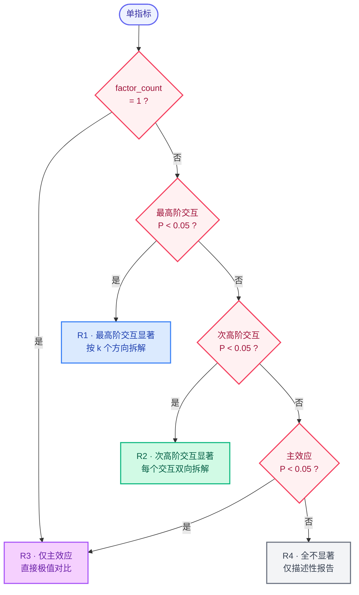

# Multi-Factor-Results-Writer

[](./LICENSE)
[](https://github.com/xiaojjo/multi-factor-results-writer/releases)
[]()
[]()
[]()
[]()

> 多因素完全析因试验（任意因素数量、任意水平数）结果段落写作决策树，把统计输出逐指标写成符合生态学期刊规范的结果段落，并一键导出 Word。

## 它解决什么问题

写多因素析因试验的 Results 段落时，常见痛点：交互怎么拆方向、两两比较 P 和 ANOVA P 混淆、多水平因素怎么报中间水平、非单调趋势（单峰/U 型）怎么检测、百分比口径不统一、GLMM 差值怎么提取、统计符号格式混乱、写完 Markdown 还要手动排版 Word。本技能用一套决策树 + 风格规范 + 零依赖转换器一次性解决。

## 获取

```bash
git clone https://github.com/xiaojjo/multi-factor-results-writer.git
```

或从 [Releases](https://github.com/xiaojjo/multi-factor-results-writer/releases) 下载压缩包。

## 使用方式

本项目是一套写作决策树和风格规范，核心文件是 `SKILL.md` 和 `references/decision_tree.json`，可灵活用于多种场景：

- **作为 AI 技能**：放入你所用 AI 平台的技能目录（如 WorkBuddy 的 `~/.workbuddy/skills/`），AI 会自动读取决策树并按规范写作
- **作为写作参考**：直接阅读 `SKILL.md` 和 `decision_tree.json`，按其中的路由算法和检查清单手动写作
- **单独使用转换器**：`scripts/md2docx.py` 可独立使用，把任意 Markdown 转为期刊排版的 Word

### 环境要求

- Python 3.8+（仅 `md2docx.py` 需要）
- R + `emmeans` 包（计算边际均值时需要，非必须）

## 适用范围

- 完全析因设计（交叉设计），因素数量任意（≥1），各因素水平数任意（≥2），各因素可不对等
- 全为分类变量
- 支持 ANOVA / LMM / GLMM
- 不适用：嵌套设计、裂区设计、含连续变量因素、含协变量

## 目录结构

```
three-factor-results-writer/
├── SKILL.md                    # 技能主文件（决策树 + 工作流 + 风格规范）
├── README.md
├── LICENSE
├── references/
│   └── decision_tree.json      # 完整决策树（R1-R4 情形 + 多水平算法 + 检查清单 + 风格规则）
└── scripts/
    └── md2docx.py              # 零依赖 Markdown → Word 转换器
```

## 工作流

1. **水平映射** — 建立各因素有序映射表，确定水平数 K，K>2 时启用多水平算法
2. **指标排序** — 按最高阶显著效应排序（最高阶 > 次高阶 > 主效应 > 全不显著）
3. **路由写作** — 每个指标路由到 R1–R4 之一（见下），按"统计分析 → 趋势分析 → 效应说明"三步写
4. **计算** — 用 R `emmeans` 算边际均值 ± SE + Tukey 校正
5. **检查** — 14 项清单逐项核对
6. **导出** — 调用 `md2docx.py` 生成同名 `.docx`

## 四类情形（R1–R4）

| 情形 | 条件 | 趋势分析要点 |
|------|------|-------------|
| **R1** 最高阶交互显著 | 最高阶交互 P < 0.05 | 拆解 k 个方向，每方向极值对比 + 中间补充 + 峰值检测 + 交互对比 |
| **R2** 次高阶交互显著 | 最高阶不显著，≥1 次高阶 P < 0.05 | 每个显著交互双向拆解 + 交互对比；未参与的显著主效应独立极值对比 |
| **R3** 仅主效应显著 | 所有交互不显著，≥1 主效应 P < 0.05 | 仅显著主效应极值对比 + 中间补充 + 平台检查 + 峰值检测 |
| **R4** 全不显著 | 全部 P ≥ 0.05 或模型不收敛 | 仅描述性报告 |

核心纪律：交互显著时，涉及的主效应不作独立解释。

## 决策树



## 多水平算法（K > 2 时触发）

当某因素水平数 > 2 时，强制执行：

1. **极值对比** — 只报 Level_K vs Level_1，禁止逐对报告
2. **中间水平补充** — K=3 报单中间水平；K>3 按顺序逐一报告；补充平台检查（Level_K vs Level_{K-1}）
3. **峰值检测** — 若两端无显著差异（P > 0.05），检查中间是否存在极值；若存在，打破顺序优先报告峰值，概括为"先升后降（单峰型）/先降后升（U型）"

## 风格规范（要点）

- P 值 3 位小数，其余统计量 2 位
- 所有均值报告 EMMs ± SE（模型标准误），禁报告原始算术平均值或标准差
- 交互符号无空格：`A×B×C`
- 两两比较 P 后置标注：`P = 0.023, 两两比较`
- 因子用「因素名 + 具体水平值」（如「温度 30 ℃」），禁相对词
- 统计符号斜体（*F*、*P*、*χ*²），数值正体
- 量词自适应：LMM 带物理单位，GLMM 二项分布带"的概率"，泊松带"次/个"
- GLMM 差值须手工相减，禁止直接提取 pairs() 的 estimate
- 禁用"表明""说明""显示"等讨论式用语
- 百分比 = (差值 / 参照组均值) × 100

## md2docx.py 用法

```bash
python scripts/md2docx.py results.md
```

零依赖（纯 Python 3 标准库），自动生成同名 `.docx`，套用期刊排版（宋体 + TNR 12pt 正文、黑体标题、A4 页面、1.5 倍行距）。

## 示例

> 三因素线性模型中，三阶交互不显著（*F*₁,₄₄₅ = 0.54, *P* = 0.462），但光照与水分二阶交互显著（*F*₁,₄₄₅ = 8.20, *P* = 0.004），温度与光照（*F*₁,₄₄₅ = 0.12, *P* = 0.730）、温度与水分（*F*₁,₄₄₅ = 1.03, *P* = 0.310）及三者间交互均不显著。温度主效应显著（*F*₁,₄₄₅ = 45.10, *P* < 0.001），光照与水分主效应因交互不作独立解释。固定低光照下，高水分光合速率为 12.50 µmol·m⁻²·s⁻¹（边际均值），较低水分（10.00）升高 2.50（+25.00%, *P* = 0.010, 两两比较）；固定高光照下，高水分光合速率为 8.00，较低水分（14.00）降低 6.00（−42.86%, *P* < 0.001, 两两比较）。固定低水分下，高光照为 8.00，较低光照（12.50）降低 4.50（−36.00%, *P* < 0.001）；固定高水分下，高光照为 14.00，较低光照（10.00）升高 4.00（+40.00%, *P* < 0.001）。因光照×水分二阶交互显著，光照与水分主效应不作独立解释。温度独立于光照与水分发挥作用：27 ℃ 个体光合速率为 15.20 µmol·m⁻²·s⁻¹（边际均值），较 22 ℃（10.00）升高 5.20（+52.00%, *P* < 0.001, 两两比较），且温度与光照、水分及三者间交互均不显著（所有 *P* > 0.05）。

## 许可证

[MIT](./LICENSE)
