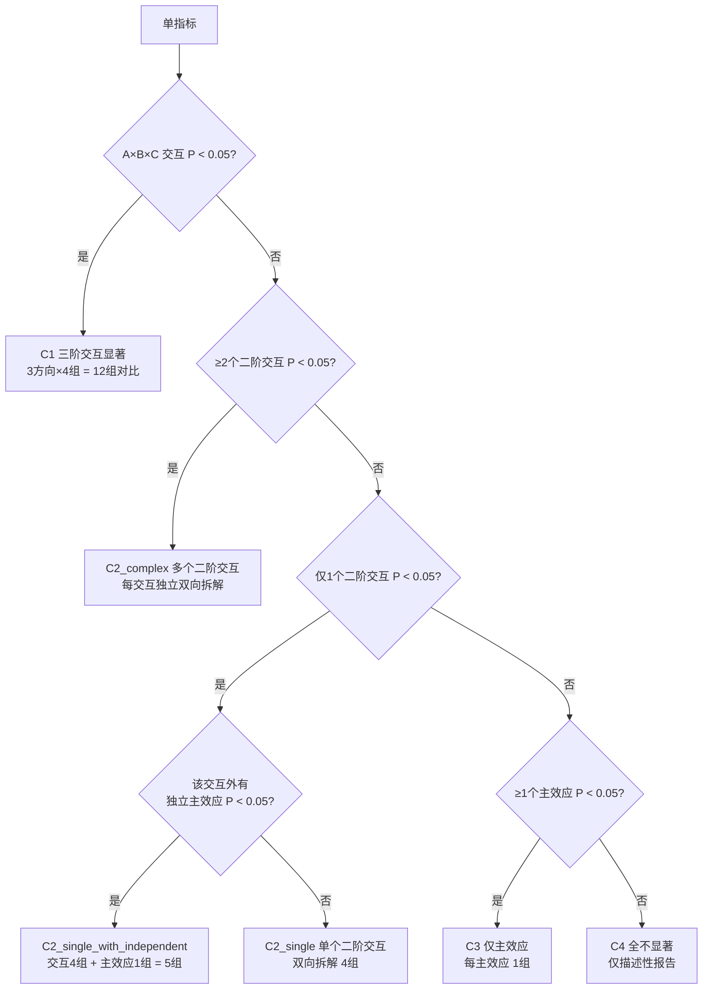

# three-factor-results-writer

[](./LICENSE)

> 三因素（2×2×2 完全析因）试验结果段落写作技能，把统计输出逐指标写成符合生态学期刊规范的结果段落，并一键导出 Word。

## 它解决什么问题

写三因素析因试验的 Results 段落时，常见痛点：三阶交互怎么拆方向、两两比较 P 和 ANOVA P 混淆、百分比口径不统一、统计符号格式混乱、写完 Markdown 还要手动排版 Word。本技能用一套决策树 + 风格规范 + 零依赖转换器一次性解决。

## 获取

```bash
git clone https://github.com/xiaojjo/Three-Factor-Results-Writer.git
```

或从 [Releases](https://github.com/xiaojjo/Three-Factor-Results-Writer/releases) 下载压缩包。

## 使用方式

本项目是一套写作决策树和风格规范，核心文件是 `SKILL.md` 和 `references/decision_tree.json`，可灵活用于多种场景：

- **作为 AI 技能**：放入你所用 AI 平台的技能目录（如 WorkBuddy 的 `~/.workbuddy/skills/`），AI 会自动读取决策树并按规范写作
- **作为写作参考**：直接阅读 `SKILL.md` 和 `decision_tree.json`，按其中的六类情形模板和检查清单手动写作
- **单独使用转换器**：`scripts/md2docx.py` 可独立使用，把任意 Markdown 转为期刊排版的 Word

### 环境要求

- Python 3.8+（仅 `md2docx.py` 需要）
- R + `emmeans` 包（计算边际均值时需要，非必须）

## 适用范围

- 三因素完全析因设计，每因素 2 水平，全为分类变量
- 支持 ANOVA / LMM / GLMM
- 不适用：嵌套设计、裂区设计、含连续变量因素、含协变量

## 目录结构

```
three-factor-results-writer/
├── SKILL.md                    # 技能主文件（决策树 + 工作流 + 风格规范）
├── README.md
├── LICENSE
├── references/
│   └── decision_tree.json      # 完整决策树（6 类情形模板 + 检查清单 + 风格规则）
└── scripts/
    └── md2docx.py              # 零依赖 Markdown → Word 转换器
```

## 工作流

1. **指标排序** — 按最高阶显著效应排序（三阶 > 二阶 > 主效应 > 全不显著）
2. **路由写作** — 每个指标路由到 6 类情形之一（见下表），按"统计分析 → 趋势分析 → 效应说明"三步写
3. **计算** — 用 R `emmeans` 算边际均值 + Tukey 校正
4. **检查** — 16 项清单逐项核对
5. **导出** — 调用 `md2docx.py` 生成同名 `.docx`

## 六类情形

| 情形 | 条件 | 对比组数 |
|------|------|----------|
| C1 三阶交互显著 | A×B×C P < 0.05 | 12 |
| C2_single 单个二阶交互 | 仅一个二阶交互 P < 0.05 | 4 |
| C2_single_with_independent 二阶交互+独立主效应 | 一个二阶交互 + 一个独立主效应 | 5 |
| C2_complex 多个二阶交互 | ≥2 个二阶交互 P < 0.05 | 每交互 4 |
| C3 仅主效应 | 所有交互不显著，≥1 主效应显著 | 每主效应 1 |
| C4 全不显著 | 全部 P ≥ 0.05 或模型不收敛 | 0 |

## 决策树

每个指标根据显著性检验结果路由到对应情形：



核心纪律：交互显著时，涉及的主效应不作独立解释。

## 风格规范（要点）

- P 值 3 位小数，其余统计量 2 位
- 交互符号无空格：`A×B×C`
- 两两比较 P 后置标注：`P = 0.023, 两两比较`
- 因子用中文称谓，禁残留代号
- 统计符号斜体（*F*、*P*、*χ²*），数值正体
- 禁用"表明""说明""显示"等讨论式用语
- 百分比 = (差值 / 参照组均值) × 100

## md2docx.py 用法

```bash
python scripts/md2docx.py results.md
```

零依赖（纯 Python 3 标准库），自动生成同名 `.docx`，套用期刊排版（宋体+TNR 12pt 正文、黑体标题、A4 页面、1.5 倍行距）。

## 示例

> 三因素线性模型中，三阶交互不显著（*F*₁,₄₄₅ = 0.54, *P* = 0.462），但光照与水分二阶交互显著（*F*₁,₄₄₅ = 8.20, *P* = 0.004），温度与光照（*F*₁,₄₄₅ = 0.12, *P* = 0.730）、温度与水分（*F*₁,₄₄₅ = 1.03, *P* = 0.310）及三者间交互均不显著。温度主效应显著（*F*₁,₄₄₅ = 45.10, *P* < 0.001），光照与水分主效应因交互不作独立解释。固定低光照下，高水分光合速率为 12.50 µmol·m⁻²·s⁻¹（边际均值），较低水分（10.00）升高 2.50（+25.00%, *P* = 0.010, 两两比较）；固定高光照下，高水分光合速率为 8.00，较低水分（14.00）降低 6.00（−42.86%, *P* < 0.001, 两两比较）。固定低水分下，高光照为 8.00，较低光照（12.50）降低 4.50（−36.00%, *P* < 0.001）；固定高水分下，高光照为 14.00，较低光照（10.00）升高 4.00（+40.00%, *P* < 0.001）。因光照×水分二阶交互显著，光照与水分主效应不作独立解释。温度独立于光照与水分发挥作用：27 ℃ 个体光合速率为 15.20 µmol·m⁻²·s⁻¹（边际均值），较 22 ℃（10.00）升高 5.20（+52.00%, *P* < 0.001, 两两比较），且温度与光照、水分及三者间交互均不显著（所有 *P* > 0.05）。

## 许可证

[MIT](./LICENSE)
