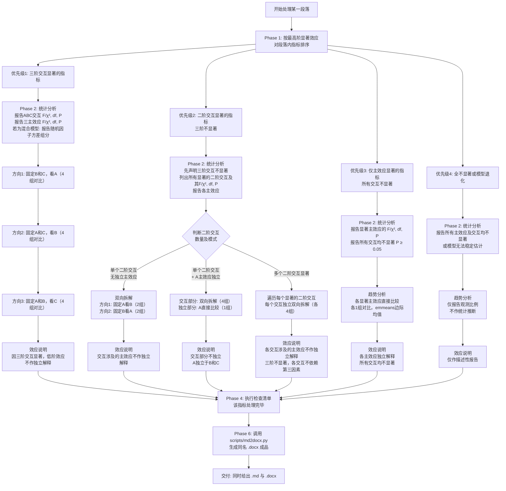

# 三因素试验结果写作决策树

> **定位**：把三因素（2×2×2 完全析因）统计结果，逐指标写成符合经典生态学期刊规范的结果（Results）段落。
> **核心模式**：每个指标 = 统计分析 → 趋势分析 → 效应说明（先报检验量，再拆方向对比）。
> **一句话纪律**：交互显著时，其涉及的主效应不作独立解释。

---

## 一、何时启用（范围边界）

### 1.1 适用设计
- 三因素**完全析因（交叉设计）**，每因素 2 水平、全为**分类变量**。
- 模型可为：三因素 ANOVA、三因素线性混合模型（LMM）、三因素广义线性混合模型（GLMM）。

### 1.2 触发条件
满足任一即启用：
- 用户提供主效应/交互项的 F、χ²、df、P 值（及/或随机因子方差组分），要求生成结果段落。
- 要求"按生态学期刊规范""逐指标""先统计后趋势"地写作八处理组合的 ANOVA、LMM、GLMM 结果。
- 给定长格式响应数据 + 模型输出，要求基于边际均值拆解各方向对比。

### 1.3 不适用（立即停止并提示用户）
> **【边界】** 以下情况本技能不适用，须改用其他方法，不要硬套模板：
> - 嵌套设计、裂区设计
> - 含连续变量因素（如温度梯度 22/25/28 ℃）
> - 含协变量的模型

---

## 二、启动前准备

### 2.1 输入要求（缺一不可，缺失即索取）
1. **响应变量数据**（长格式）：响应值、因素 A/B/C 各水平标识、随机因子标识。
2. **统计模型输出**：主效应及交互项的 F/χ² 值、df、P 值；随机因子方差组分。
3. **因素水平定义**：A/B/C 各两个水平的具体名称与单位。

### 2.2 全局规范（数值 / 语言 / 校正）

**数值格式（强制）**
- P 值：保留 **3 位小数**；`P < 0.001` 写 `< 0.001`，`P > 0.99` 写 `> 0.99`。
- 其余统计量（均值、差值、百分比、F、χ²、SD/SE、方差组分）：保留 **2 位小数**，标准四舍五入。

**百分比口径（强制）**
> 百分比 = (差值 / 参照组均值) × 100，保留 2 位。正方向 `+X.XX%`，负方向 `−X.XX%`（半角减号 −）。GLM/GLMM 反变换概率的分母必须用参照组均值。

**语言约束**
> **【禁止】** 使用"表明""说明""显示""揭示""暗示""证实""证明"等讨论式用语。仅事实性陈述允许，且须以数据模式描述、不以结论/价值判断收尾。

**校正与计算**
- 趋势分析基于边际均值（EMMs），用 R `emmeans` 包或等效软件计算。
- 两两比较校正：**Tukey HSD**。
- P 值来源须区分：ANOVA 报模型固定效应 F/似然比检验 P；两两比较报 `emmeans` 两两 P 并标注"两两比较"。

---

## 三、风格统一规范（强制，全稿一致）

> 以下规则覆盖所有易漂移项，任何指标、任何结果节均不得违反。完整落地细节与示例见 `references/decision_tree.json` 的"风格统一规范"一节。

| 维度 | 强制规则 |
|------|----------|
| **标点** | 中文正文用半角 `,` `.` `()`；数字/统计量/单位/百分号前后不夹全角空格。禁全角「，」「。」与半角混用。 |
| **交互符号** | 因素间一律无空格乘号「×」（`A×B×C`）。禁「A × B」带空格写法。 |
| **两两比较标注** | 一律后置：`P = 【值】, 两两比较`，置于对应对比后。ANOVA 主效应/交互 P 不标"两两比较"，二者必须区分。 |
| **因子称谓** | 用生物学中文称谓（「冷背景/暖背景」「22 ℃发育/27 ℃发育」），禁残留 `A/B/C`、`dev22`、`p−` 等代号。 |
| **拆解排版** | 趋势分析用连续段落，禁无序列表 bullet；统计/趋势/效应三段之间空行分隔。 |
| **模型声明** | 模型类型与随机因子在结果节开头集中声明一次；各指标段内只报检验量与 P 值。 |
| **百分比双报** | 先写变化量「升高/降低 X.XX 单位」，再写「（+X.XX%, P = …, 两两比较）」。 |
| **图号** | 同一文档内统一，初稿「图【待补充】」，定稿统一替换；禁子图号与整图号混用无说明。 |
| **偏 η²** | 同类模型统一伴随（`η²ₚ = X.XX`）或不报，禁部分报、部分不报。 |
| **内部标记** | 路由标识 C1–C4 仅用于写作过程，禁进入交付文本的小节标题。 |

---

## 四、五阶段工作流

> 从指标排序，经 Phase 2 路由（C1 / C2 / C3 / C4），到 Phase 4 检查清单，最后 Phase 6 导出 Word。完整路径速览：



### 阶段 1 — 指标排序
当一段落含多个响应指标，按以下优先级决定写作顺序（详细规则见 `references/decision_tree.json` 的 phase_1）：
1. 三阶交互（A×B×C）ANOVA P < 0.05 → 排最前（核心发现）。
2. 三阶不显著，但至少一阶二阶交互 ANOVA P < 0.05 → 排其后。
3. 所有交互不显著，但至少一主效应 ANOVA P < 0.05 → 排最后。
4. 全部不显著或模型退化（不收敛/完全分离）→ 末尾补充说明。

### 阶段 2 — 单指标写作（路由表）
每个指标按"统计分析 → 趋势分析 → 效应说明"三步组织，依据显著性路由到以下情形之一（完整模板见 `references/decision_tree.json` 的 phase_2）：

| 情形 | 标识 | 路由条件 | 对比组数 |
|------|------|----------|----------|
| 三阶交互显著 | C1 | A×B×C 交互 P < 0.05 | 3 方向×4 组 = 12 组 |
| 单个二阶交互显著（三阶不显著） | C2_single | 仅一个二阶交互 P < 0.05 | 双向拆解 4 组 |
| 二阶交互显著 + 独立主效应 | C2_single_with_independent | 一个二阶交互 P < 0.05 且某主效应 P < 0.05，其余交互均不显著 | 交互 4 组 + 独立主效应 1 组 = 5 组 |
| 多个二阶交互同时显著 | C2_complex | 至少两个二阶交互 P < 0.05 | 每交互独立双向拆解（各 4 组） |
| 仅主效应显著 | C3 | 所有交互 P ≥ 0.05，至少一主效应 P < 0.05 | 每显著主效应 1 组 |
| 全不显著或模型退化 | C4 | 全部 P ≥ 0.05，或模型不收敛/完全分离 | 0 组（仅描述性） |

> **【关键纪律】**
> - **C1（三阶显著）**：必须报 3 种拆解方向（固定 B、C 看 A；固定 A、C 看 B；固定 A、B 看 C）。方向 1、2 必报，方向 3 推荐报。
> - **二阶交互显著**：双向拆解（固定一因素看另一因素，反之亦然）；涉及的主效应不作独立解释。
> - **C3（独立主效应）**：各主效应直接比较两个水平，且声明与其他因素的交互均不显著。

### 阶段 3 — 计算指令
执行趋势对比时，按 `references/decision_tree.json` 的 phase_3 调用对应 `emmeans` 公式并取 `pairs(adjust = 'tukey')`：
- 公式示例：`~ A | B * C`、`~ B | A * C`、`~ C | A * B`、`~ A | B`。
- 从 `anova(model)` 提取 ANOVA P 值（3 位）；从 `pairs()` 提取 `p.value`（3 位）、`estimate`（2 位）。
- 参照组选较低水平，报告较高水平相对其变化；其余统计量（F、χ²、均值、SD）均 2 位。

### 阶段 4 — 最终检查清单
每个指标生成后，逐项核对 `references/decision_tree.json` 的 phase_4 清单（共 16 项），重点确认：
- 模型类型明确、随机因子方差组分已报；
- 交互显著性对应的拆解方向齐全、EMMs 已用；
- ANOVA P 与两两比较 P 已区分；
- 交互显著时主效应不独立解释；
- 禁用讨论式用语、P 值 3 位其余 2 位、图号已标注；
- **风格一致性（清单 13–16）**：半角标点、无空格「×」、两两比较后置、中文因子称谓、纯段落排版、节首集中模型声明、标题无 C1–C4 标记、偏 η² 口径统一。

### 阶段 5 — 占位符管理
生成初稿时所有未知数据使用占位符（见 `references/decision_tree.json` 的 phase_5，如【响应变量名称】【F值】【P值】【X.XX】【单位】【图号】等）。用户填入实际数据后，替换所有占位符并核对统计量一致性。

### 阶段 6 — Word 导出（强制，每次生成 md 后执行）
> **【强制】** 本技能产出必须是 Markdown 文件；每次落盘结果 md 后，**必须立即调用内置脚本生成同名 `.docx`**，二者并列同目录。

脚本位置：`{SKILL_ROOT}/scripts/md2docx.py`

> **【跨机器可移植】** 该脚本为**纯 Python 3 标准库实现**，不依赖 `python-docx` / `markdown`，无需联网 pip 安装。

**动态定位 Python 解释器（按序尝试，命中即用）：**
1. WorkBuddy 托管 Python（优先，隔离稳定）：
   - Windows：`C:/Users/<用户名>/.workbuddy/binaries/python/versions/<版本>/python.exe`
   - macOS/Linux：`~/.workbuddy/binaries/python/versions/<版本>/python`
2. 系统 PATH 中的 `python3`（或 `python`）。
3. 以上均无 → 提示用户安装 Python 3.8+（官方包勾选 "Add to PATH"），或改用其本机任意 Python 3。

**调用方式：**
```bash
# <PY> 为上面动态找到的 python 路径
<PY> "{SKILL_ROOT}/scripts/md2docx.py" <结果md路径>
```

脚本自动套用的排版规范（沿用 `typeset7.py`，与期刊投稿格式一致）：

| 元素 | md 写法 | Word 排版 |
|------|---------|-----------|
| 一级标题 | `# xxx` | 黑体 16pt 加粗，左对齐 |
| 二级标题 | `## xxx` | 黑体 14pt 加粗，左对齐 |
| 三级标题 | `### xxx` | 黑体 13pt 加粗，左对齐 |
| 正文段落 | 直接写 | 宋体+Times New Roman 12pt，两端对齐，1.5 倍行距，段前后 6pt |
| 粗体 | `**text**` | 加粗（保留） |
| 斜体 | `*text*` | 斜体（保留，用于 *F* / *P* / *χ²* 等统计符号） |
| 表格 | md 标准管道表 | 细网格边框，表头加粗，10.5pt |
| 代码块 | ` ``` ` fence | Consolas 10.5pt |
| 引用 | `> text` | 左缩进 0.74cm |
| 页面 | — | A4，四边页边距 2.54cm |

> **注意事项**：md 含 BOM 头时脚本以 `utf-8-sig` 读取自动剥离（`#` 不丢失）；输出 docx 与 md 同名同目录，重跑覆盖旧文件；交付时**同时给 md（源）与 docx（投稿/审阅成品）**。

---

## 五、资源索引

- `references/decision_tree.json` — 完整决策树：phase_1 排序规则、phase_2 六类情形全模板与方向拆解、phase_3 R 代码与抽取规则、phase_4 检查清单、phase_5 占位符表、quick reference 数值格式与情形汇总。**写作任一指标前先读取该文件以套用精确模板。**
- `scripts/md2docx.py` — 内置 Markdown→Word 转换器（纯标准库）。每次生成结果 md 后调用（见阶段 6），自动产出符合期刊排版规范的同名 `.docx`。
