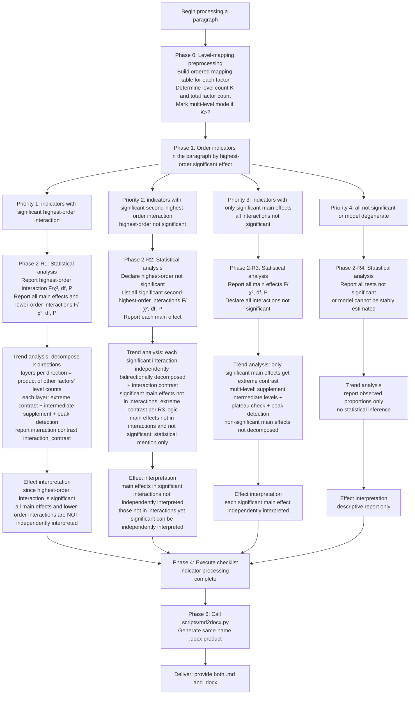

# Multi-Factor Experimental Result Writing Decision Tree (General Version)

> **Positioning**: Write, indicator by indicator, the Results paragraphs conforming to canonical ecology-journal standards from the statistical output of multi-factor (complete factorial design, any number of factors, any number of levels) experiments.
> **Core pattern**: Each indicator = statistical analysis → trend analysis → effect interpretation (report the test statistic first, then decompose directional contrasts).
> **One-line discipline**: When an interaction is significant, the main effects it involves must NOT be interpreted independently.

---

## I. When to Activate (Scope Boundaries)

### 1.1 Applicable designs
- Complete factorial design (crossed design), any positive-integer number of factors (≥1), any positive-integer number of levels per factor (≥2), factors may be unequal (e.g., 2×3×4, 5×5×5), all **categorical variables**.
- Models may be: one-way ANOVA, two-way ANOVA, three-way ANOVA, linear mixed model (LMM), generalized linear mixed model (GLMM).

### 1.2 Triggering conditions
Activate if any of the following is met:
- The user provides F, χ², df, P values of main effects / interaction terms (and/or variance components of random factors) and asks to generate results paragraphs.
- Asks to write ANOVA, LMM, GLMM results of a complete factorial experiment "according to ecology-journal standards", "indicator by indicator", "statistics first then trend".
- Given long-format response data + model output, asks to decompose directional contrasts based on estimated marginal means.

### 1.3 Not applicable (stop immediately and inform the user)
> **[Boundary]** The following cases are NOT covered by this skill; use another method, do not force-fit the template:
> - Nested designs, split-plot designs
> - Models containing continuous-factor variables
> - Models containing covariates

---

## II. Pre-Startup Preparation

### 2.1 Input requirements (all mandatory; solicit if missing)
1. **Response variable data** (long format): response values, level identifiers of each factor, random-factor identifiers.
2. **Statistical model output**: F/χ² values, df, P values of main effects and all interaction terms; random-factor variance components.
3. **Factor level definitions**: level names and order of each factor; if an unordered categorical variable, a reference level must be specified.
4. **Factor count factor_count** (e.g., 1, 2, 3).

### 2.2 Global conventions (numerics / language / correction)

**Numeric format (mandatory)**
- P values: keep **3 decimal places**; write `P < 0.001` as `< 0.001`, `P > 0.99` as `> 0.99`.
- Other statistics (means, differences, percentages, F, χ², SE, variance components): keep **2 decimal places**, standard rounding.

**Percentage convention (mandatory)**
> Percentage = (difference / reference-group mean) × 100, keep 2 decimals. Positive direction `+X.XX%`, negative direction `−X.XX%` (half-width minus −). For GLM/GLMM back-transformed probabilities, the denominator MUST be the reference-group mean.

**Mean reporting (mandatory)**
> All means reported in parentheses MUST be **estimated marginal means (EMMs)**, and MUST be accompanied by the model standard error (SE), format: `X.XX ± X.XX`. Reporting raw arithmetic means or standard deviations is prohibited.

**Language constraints**
> **[Prohibited]** Use discussion-style phrasing such as "indicate / show / reveal / imply / confirm / prove" (表明/说明/显示/揭示/暗示/证实/证明). Only factual statements are allowed, and they must describe the data pattern, not end with a conclusion / value judgment.

**Correction and computation**
- Trend analysis is based on estimated marginal means (EMMs), computed with the R `emmeans` package or equivalent software.
- Pairwise comparison correction: **Tukey HSD**.
- P-value sources must be distinguished: ANOVA reports model fixed-effect F / likelihood-ratio-test P; pairwise comparisons report `emmeans` pairwise P and label "pairwise comparison" (两两比较).

**GLMM difference extraction (mandatory)**
> GLMM differences MUST NOT be extracted directly from `pairs()` (because under `type='response'` the estimate is a ratio); one MUST extract the response-scale means via `as.data.frame(emmeans(...))` and then **subtract manually**.

### 2.3 Universal Extrapolation Protocol

> **[Mandatory]** When handling a design other than 2×2×2, the AI MUST execute the following protocol and MUST NOT refuse to generate on the grounds that "the template does not specify it."

1. **Level mapping**: Arrange the user's factor levels in numeric or logical order, marked as Level_1 (lowest), Level_2, …, Level_K (highest). If a factor is an unordered categorical variable, the user specifies a reference level as Level_1, and the rest are ordered as specified.
2. **Contrast selection**: Report only Level_K vs Level_1 (extreme contrast); reporting Level_i vs Level_j (i ≠ 1, K) pairwise is prohibited.
3. **Intermediate levels**: If K > 2, Level_2 … Level_{K-1} are all "intermediate levels", described in a supplementary sentence after the extreme contrast, in order.
4. **Layer count computation**: When decomposing directions, the number of layers = the product of the level counts of the other factors (e.g., when fixing B, C to view A, layers = K_B × K_C).
5. **Sentence migration**: Treat the `template_logic` field in `decision_tree.json` as an algorithmic description, not a verbatim string to copy. The AI should convert it into a coherent paragraph conforming to natural English expression.
6. **Stability guarantee**: If some factor has > 10 levels (extreme case), still report by extreme contrast + the two terminal intermediate levels (Level_2 and Level_{K-1}), without traversing all intermediate levels layer by layer.

---

## III. Multi-Level Universal Algorithm (multi_level_universal_algorithm)

> Enforced whenever any factor has K > 2 levels. Core principles: extreme-contrast first → intermediate-level supplementation → non-monotonic trend detection → plateau check.

### 3.1 Extreme contrast
By default report only Level_K vs Level_1 as the core finding. Intermediate levels are described in order via supplementary sentences. If peak detection (3.3) triggers, this default order is broken.

### 3.2 Intermediate-level supplementation
- **K=3 single intermediate level**: Report the change amount and P value of Level_2 relative to Level_1, and its comparison with Level_K.
- **K>3 multiple intermediate levels**: Report changes relative to Level_1 in order Level_2 → … → Level_{K-1}.
- **Plateau check (mandatory for K>2)**: Supplement the comparison of the highest level with the second-to-last level. Sentence form: "Level_K (X.XX ± X.XX) increased/decreased by X.XX relative to Level_{K-1} (X.XX ± X.XX) (+/-X.XX%, *P* = [value], pairwise comparison), showing a plateau trend / a continuously rising trend."

### 3.3 Non-monotonic trend peak detection (peak_detection_rule)
> Ecological data often have an optimal intermediate point; do not omit reporting it.

- **Trigger condition**: If the extreme contrast (Level_K vs Level_1) has P > 0.05 (no significant difference), one MUST check whether an intermediate level exists that is significantly higher or lower than both endpoints.
- **Action**: If some intermediate level Level_i is significantly higher/lower than both endpoints, break the sequential reporting rule and report that Level_i first. The remaining intermediate levels are summarized as "no significant difference reached", without listing one by one.
- **Trend summary**: Overall shows a rise-then-fall (unimodal) / fall-then-rise (U-shaped) trend.

### 3.4 Performance guarantee
If some direction has > 25 layers, prompt the user to report first the 3–5 layers with the strongest effects, and summarize the rest.

---

## IV. Style Unification Convention (mandatory, consistent throughout)

> The following rules cover all easily-drifting items; no indicator or results section may violate them. For complete implementation details and examples, see the `style_rules` section of `references/decision_tree.json`.

| # | Dimension | Mandatory rule |
|---|------|----------|
| 1 | **Punctuation** | Uniformly use half-width `,` `.` `()`. Mixing full-width and half-width is prohibited. |
| 2 | **Interaction symbol** | Factor multiplication uniformly uses the space-free multiplication sign `×`: `F1×F2×F3`. Space-containing forms are prohibited. |
| 3 | **Pairwise-comparison label** | Uniformly post-positioned: `P = [value], pairwise comparison`. ANOVA main-effect P is not labeled "pairwise comparison"; the two MUST be distinguished. |
| 4 | **Factor naming** | Use "factor name + specific level value/name" (e.g., "temperature 30 ℃", "moisture normal"), prohibiting relative words like "high temperature" / "control". |
| 5 | **Decomposition layout** | Trend analysis uses continuous paragraphs, no unordered bullet lists; leave a blank line between the statistics / trend / effect three segments. |
| 6 | **Model declaration** | Model type and random factors are declared once centrally at the beginning of the results section; within each indicator section only test statistics and P values are reported. |
| 7 | **Percentage dual-report** | First write the change amount "increased/decreased by X.XX", then write "(+/-X.XX%, *P* = …, pairwise comparison)". |
| 8 | **Figure numbers** | Draft "Figure [to be added]"; replace uniformly in the final version; do not mix sub-figure numbers and whole-figure numbers without explanation. |
| 9 | **Partial η²** | Uniformly accompany (with `η²ₚ = X.XX`) or omit across the same model type; partially reporting is prohibited. |
| 10 | **Internal markers** | Routing identifiers R1–R4 are for the writing process only, prohibited from entering the delivered text's subsection headings. |
| 11 | **Location-scale model** | The scale part is an independent paragraph, using the same model and the same Type III test as the location part. |
| 12 | **Statistical symbol font** | *F*, *P*, *t*, *χ*², *η*² etc. italic. Degrees of freedom, equals sign, and values remain upright. |
| 13 | **Response-variable measure-word adaptation** | Continuous variables report physical units (e.g., mg); binomial reports "X.XX ± X.XX probability" or percentage; Poisson / negative-binomial report count measure-words (e.g., times, individuals). Writing unitless pure numbers for count data is prohibited. |
| 14 | **Mean variability reporting** | All means in parentheses MUST be EMMs ± SE (model standard error); reporting raw arithmetic means or standard deviations is prohibited. |

---

## V. Five-Phase Workflow

> From level-mapping preprocessing, through indicator ordering and routing (R1 / R2 / R3 / R4), to the checklist, and finally Word export. Full path overview:



### Routing decision rules

| Step | Condition | Route |
|------|------|------|
| 1 | factor_count = 1 | Go directly to R3 (no interaction term) |
| 2 | highest-order interaction P < 0.05 | **R1** highest-order interaction significant |
| 3 | highest-order not significant, second-highest-order P < 0.05 | **R2** second-highest-order interaction significant |
| 4 | all interactions not significant, main effect P < 0.05 | **R3** only main effect significant |
| 5 | all not significant or model degenerate | **R4** all not significant |

---

## VI. Four Scenarios in Detail (R1–R4)

### R1 — Highest-order interaction significant

**Condition**: ANOVA P < 0.05 for the highest-order interaction term (order = factor_count).

**Statistical analysis**: Report the F/χ², df, P of that highest-order interaction. Report item by item all main effects and lower-order interactions' F/χ², df, P (regardless of significance). Mixed models report random-factor variance components.

**Trend analysis**:
- Decompose k directions (k = number of factors in the interaction). Each direction fixes the other factors, examining the current factor.
- Each layer extracts the difference, percentage, P value of the extreme contrast (Level_K vs Level_1); if K > 2, perform intermediate-level supplementation and peak detection.
- **Interaction contrast (interaction_contrast)**: MUST report the difference between simple effects to clarify the interaction source.

**Effect interpretation**: Since the highest-order interaction is significant, all main effects and lower-order interactions are NOT independently interpreted. One MUST characterize, with concrete within-layer values, where the effect appears / disappears / reverses.

### R2 — Second-highest-order interaction significant (highest-order not significant)

**Condition**: highest-order interaction P ≥ 0.05, and at least one second-highest-order interaction P < 0.05.

**Statistical analysis**: Declare highest-order not significant. Report all significant second-highest-order interactions' F/χ², df, P. Report the remaining lower-order interactions as not significant. Report all main effects item by item.

**Trend analysis**:
- Each significant second-highest-order interaction independently executes bidirectional decomposition + interaction contrast.
- **Main effects not in interactions**: if significant → extreme contrast per R3 logic (independently interpreted); if not significant → only mentioned in the statistical part.

**Effect interpretation**: Main effects participating in significant interactions are not independently interpreted; those not participating yet significant can be independently interpreted.

### R3 — Only main effects significant

**Condition**: all interaction P ≥ 0.05 (or no interactions exist), and at least one main effect P < 0.05.

**Statistical analysis**: Report all main effects' F/χ², df, P item by item. Declare all interactions not significant.

**Trend analysis**: Perform extreme contrast only for significant main effects. For multi-level, supplement intermediate levels + plateau check + peak detection. Non-significant main effects are not decomposed. Arrange in ascending order of P value.

**Effect interpretation**: Each significant main effect is independently interpreted.

### R4 — All not significant or model degenerate

**Statistical analysis**: Report that the model could not be stably estimated or all tests are not significant.

**Trend analysis**: Report only observed proportions or descriptive data, no statistical inference.

**Effect interpretation**: This result is reported only descriptively with observed proportions.

---

## VII. R Code Templates

```r
# Type III ANOVA (contrasts must be set)
library(car)
options(contrasts = c('contr.sum', 'contr.poly'))
model <- lm(response ~ F1 * F2 * F3, data = dat)
Anova(model, type = 3)

# Mixed models
model <- lmer(response ~ F1 * F2 * F3 + (1|block), data = dat)      # LMM
model <- glmer(response ~ F1 * F2 * F3 + (1|block), family = binomial, data = dat)  # GLMM

# Estimated marginal means and pairwise comparisons
emm <- emmeans(model, ~ F1 | F2 * F3, type = 'response')   # R1: highest-order interaction decomposition
emm <- emmeans(model, ~ F2 | F1, type = 'response')         # R2: second-order interaction decomposition
emm <- emmeans(model, ~ F1, type = 'response')              # R3: main effect
pairs(emm, adjust = 'tukey')

# GLMM difference extraction (directly using pairs() estimate is prohibited)
emm_resp <- emmeans(model, ~ F1 | F2 * F3, type = 'response')
emm_df <- as.data.frame(emm_resp)   # extract response column as mean, subtract manually

# Interaction contrast
emm <- emmeans(model, ~ F2 | F1, type = 'response')
contrast(emm, interaction = 'pairwise', adjust = 'tukey')
```

### Decomposition specification discipline

| Scenario | Correct specification | Common error |
|------|----------|----------|
| R1 highest-order interaction | Keep all factors stratified: `~ F1 \| F2 * F3` | ❌ misusing a marginalized specification |
| R2 second-highest-order interaction | Marginalize uninvolved factors: `~ F1 \| F2` | ❌ reusing highest-order fine decomposition |
| R3 only main effect | `~ F1`, marginalize all other factors | ❌ performing any stratified decomposition |

---

## VIII. Final-Draft Checklist

- [ ] Was Phase 0 level-mapping preprocessing executed?
- [ ] In R1/R2/R3, are all main effects' F/χ² and P values reported in the statistics part (regardless of significance)?
- [ ] Are R1/R2 decomposition directions complete? Is the layer count computed dynamically?
- [ ] Is EMM computation and P-value distinction correct (ANOVA P vs pairwise-comparison P correctly labeled)?
- [ ] For multi-level factors, was the plateau check (Level_K vs Level_{K-1}) executed?
- [ ] For multi-level factors, when both endpoints show no significant difference, was peak detection triggered to report the intermediate extreme?
- [ ] Is the measure-word adaptation correct (LMM with physical units, GLMM binomial with "probability", Poisson with "times/individuals")?
- [ ] For GLMM, was direct extraction of pairs() estimate avoided, and the absolute difference computed manually from extracted response-scale means?
- [ ] Are all means in parentheses reported as EMMs ± SE?
- [ ] In the R2 branch, for main effects not participating in significant interactions: if significant, are they independently decomposed? if not significant, are they only mentioned in the statistics part?
- [ ] When interaction is significant, is it declared that main effects are not independently interpreted? Is the interaction contrast reported?
- [ ] Are discussion-style phrases avoided? Are numeric precision and punctuation fully compliant?
- [ ] Are factor names all in "factor name + specific level value" format, with no relative words remaining?
- [ ] Does the ANOVA note the sum-of-squares type? Is the pairs() sign direction verified?

---

## IX. Style Example

>**Second instar duration (developmental temperature × background temperature two-way interaction significant; pesticide background main effect significant)**

>In the Type III test of the three-factor linear model, the three-way interaction was not significant (*F*₂,₄₄₅ = [F-value], *P* = [P-value]), only the developmental temperature × background temperature two-way interaction was significant (*F*₂,₄₄₅ = [F-value], *P* = [P-value]), while developmental temperature × pesticide background (*F*₂,₄₄₅ = [F-value], *P* = [P-value]) and background temperature × pesticide background (*F*₁,₄₄₅ = [F-value], *P* = [P-value]) were not significant; the main effects of developmental temperature (*F*₂,₄₄₅ = [F-value], *P* = [P-value]) and background temperature (*F*₁,₄₄₅ = [F-value], *P* = [P-value]) were not significant, but the main effect of pesticide background was significant (*F*₁,₄₄₅ = [F-value], *P* = [P-value]) (Figure [figure number]).
>
>Direction 1 (fixed background temperature, marginalizing over pesticide background, comparing developmental temperature; developmental temperature 27 ℃ vs 22 ℃): At background temperature 15 ℃, the second instar duration of the developmental temperature 27 ℃ group was [X.XX ± X.XX] d, which did not differ significantly from the developmental temperature 22 ℃ group ([X.XX ± X.XX] d) (*P* = [P-value], pairwise comparison); however, the developmental temperature 25 ℃ group ([X.XX ± X.XX] d) increased by [X.XX] relative to the developmental temperature 22 ℃ group (+[X.XX]%, *P* = [P-value], pairwise comparison), and increased by [X.XX] relative to the developmental temperature 27 ℃ group (+[X.XX]%, *P* = [P-value], pairwise comparison), overall showing an initial increase followed by a decrease (unimodal pattern). At background temperature 25 ℃, the developmental temperature 27 ℃ group ([X.XX ± X.XX] d) increased by [X.XX] relative to the developmental temperature 22 ℃ group ([X.XX ± X.XX] d) (+[X.XX]%, *P* = [P-value], pairwise comparison); the developmental temperature 25 ℃ group ([X.XX ± X.XX] d) increased by [X.XX] relative to the developmental temperature 22 ℃ group (+[X.XX]%, *P* = [P-value], pairwise comparison), and did not differ significantly from the developmental temperature 27 ℃ group (*P* = [P-value], pairwise comparison), showing a plateau trend after continuous increase.
>
>Direction 2 (fixed developmental temperature, marginalizing over pesticide background, comparing background temperature; background temperature 25 ℃ vs 15 ℃): At developmental temperature 22 ℃, the background temperature 25 ℃ group had a second instar duration of [X.XX ± X.XX] d, which increased/decreased by [X.XX] relative to the background temperature 15 ℃ group ([X.XX ± X.XX] d) (+/-[X.XX]%, *P* = [P-value], pairwise comparison); at developmental temperature 25 ℃, the background temperature 25 ℃ group was [X.XX ± X.XX] d, which increased/decreased by [X.XX] relative to the background temperature 15 ℃ group ([X.XX ± X.XX] d) (+/-[X.XX]%, *P* = [P-value], pairwise comparison); at developmental temperature 27 ℃, the background temperature 25 ℃ group was [X.XX ± X.XX] d, which increased/decreased by [X.XX] relative to the background temperature 15 ℃ group ([X.XX ± X.XX] d) (+/-[X.XX]%, *P* = [P-value], pairwise comparison).
>
>Direction 3 (marginalizing over developmental temperature and background temperature, comparing pesticide background; with pesticide vs without pesticide): The with-pesticide group had a second instar duration of [X.XX ± X.XX] d (marginal mean), which increased/decreased by [X.XX] relative to the without-pesticide group ([X.XX ± X.XX] d) (+/-[X.XX]%, *P* = [P-value], pairwise comparison).
>
>The developmental temperature × background temperature interaction contrast indicated that the effect of developmental temperature differed significantly between background temperature 15 ℃ and 25 ℃ (*P* = [P-value], pairwise comparison). Because the developmental temperature × background temperature two-way interaction was significant, the main effects of developmental temperature and background temperature were not interpreted independently; because pesticide background did not participate in any significant interaction and its main effect was significant, its effect was independent of developmental temperature and background temperature and could be interpreted independently.
---

## X. Attached Scripts

### md2docx.py — Zero-dependency Markdown → Word converter

```bash
python scripts/md2docx.py results.md [output.docx]
```

- Depends only on the Python 3.8+ standard library (zipfile + xml); no third-party packages needed.
- Automatically generates a same-name `.docx`, applying journal typography (SimSun + Times New Roman 12pt body, SimHei bold headings, A4 page, 1.5 line spacing).
- Supports: headings, paragraphs, bold/italic/inline code, code blocks, ordered/unordered lists, tables, blockquotes, horizontal rules.
